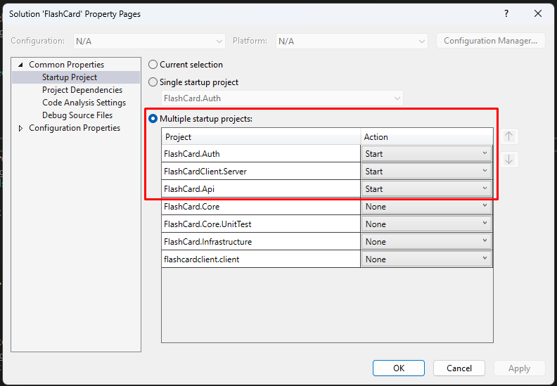

# AI-Powered Flash Card

An English learning flash card system.

Deployed application:
- Url: https://tdevflashcard.azurewebsites.net
- Username: alice
- Password: Pass123$


## Features
- [x] User authentication: signup, login, and logout. Support login with Google
- [x] Flash card management: create, read, update, and delete
- [x] Study mode: a basic carousel for users to review their flashcards
- [x] AI-Powered enhancement: use AI to generate example sentences for vocabulary words
- [x] AI image suggestion


## High level architecture


## Technologies

- Auth
  - Duende (IdentityServer) a famous OpenID Connect and OAuth 2.0 framework. Allows us to manage users ourselve
  - Asp Net Core Identity: provided by Microsoft, to ease the user management, supported by Duende
  - Sqlite: to have a quick development. Must be replaced by MSSQL Server or Postgres when deploying to Staging or higher environments
- Client app
  - React
  - React bootstrap: I want to have friendly UI and easy to develope the app. It turns out this is not a good choice. The Tooltip makes my UI shake. No built-in hooks for the Toast
  - React router dom V6: just want to try the taste of "loader" and "action"
- BFF
  - .Net 8: a robust framework with many advantages like cross-platform, rich libraries and tools, built-in security features, large community, integrate well with various databases, cloud services, and third-party APIs, high performance
  - YARP: to forward requests from the SPA to the API without writing code
- API
  - EF Core: to manipulate data with several benefits like cros-platform, code-first approach, migrations, multiple database providers, strong community and extensive documentation
  - Azure OpenAI Chat Completion service: backed by Microsoft and OpenAI, it benefits from extensive documentation, support. Easy to integrate
  - Azure OpenAI Dall-E: excels in producing imaginative and detailed visuals
  - .Net 8
  - Sqlite


## Local setup instructions

### Prerequisites

- .Net 8 SDK
- Node 16 or higher
- Visual Studio 2022 (optional)

### Start projects

3 projects to start
- FlashCard.Auth
- FlashCardClient.Server
- FlashCard.Api

#### With Visual Studio

Configure startup projects



#### Or, with cmd

Open a new cmd
```
cd src\FlashCard.Auth
dotnet run
```

Open another cmd
```
cd src\FlashCardClient\FlashCardClient.Server
dotnet run
```

Open another cmd
```
cd src\FlashCard.Api
dotnet run
```

### Open the app in browser

https://localhost:5173/


## Known issues and limitations
- UI responsiveness. Currently, it is not mobile friendly
- No paging
- Handle session timeout more properly. Currently, it auto redirects user to the login page
- The current prompt is not optimized. Sometimes, it fails to generate example sentences or images. Especially if the user has a typo
- After the image is generated, it may take from 15 to 30s to show the image. It is because of the large size and the storage region
- To avoid over-use, the app disables the "AI Generate Image" button if the card already has an image

## Ideas for future improvements
- A better UI design
- Search decks
- Paging + sorting
- Allow user to revert word and meaning for all cards in a deck
- Mark learned cards, remove from learning
- Reduce the size of the generated image and store to our Blob to improve loading time
- Allow users to accept or decline an AI suggestion